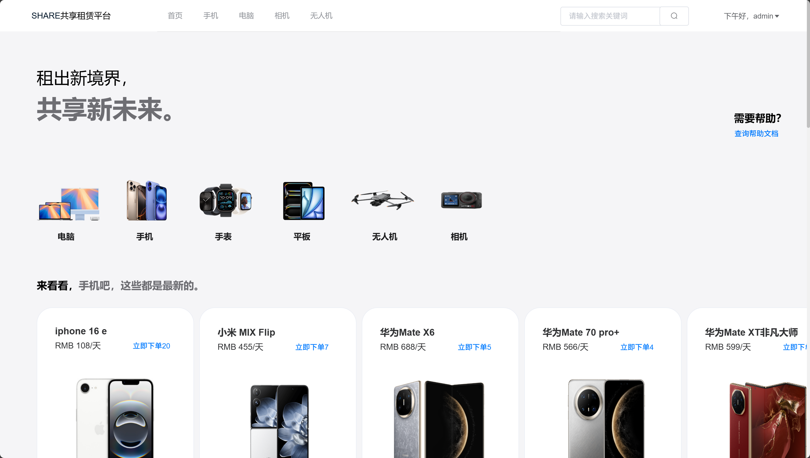
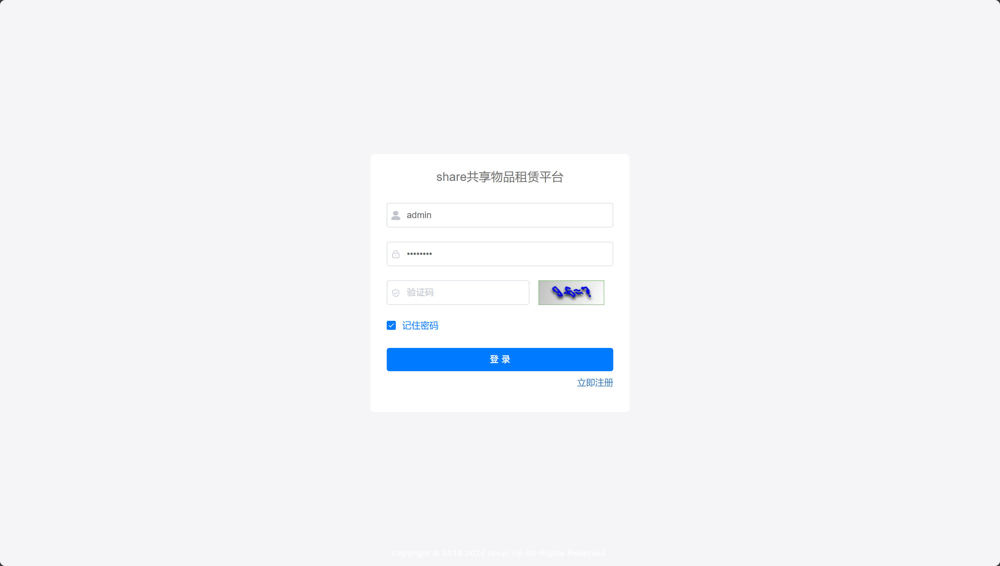
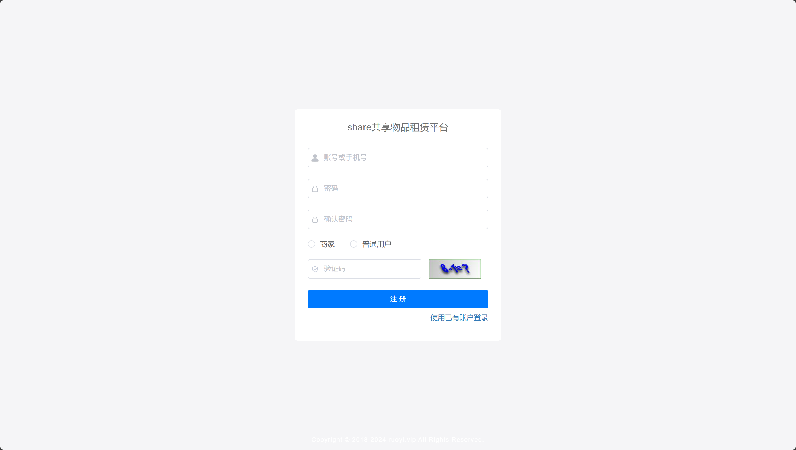
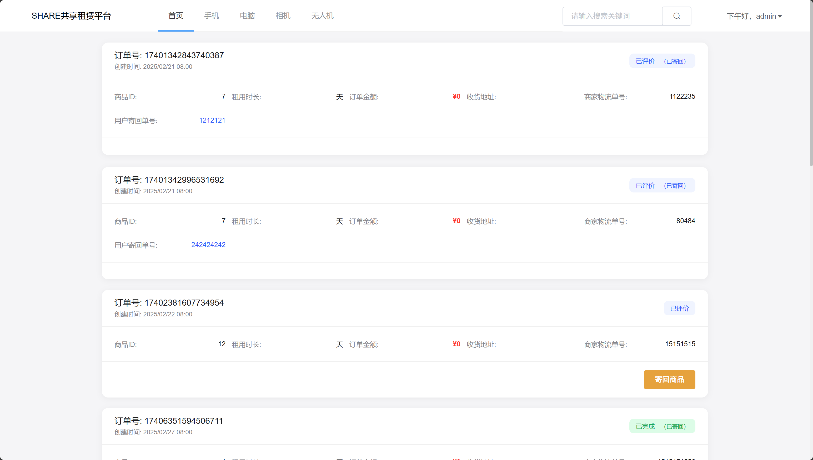
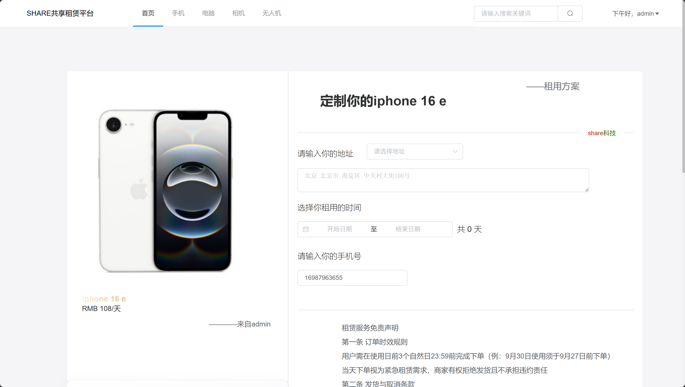
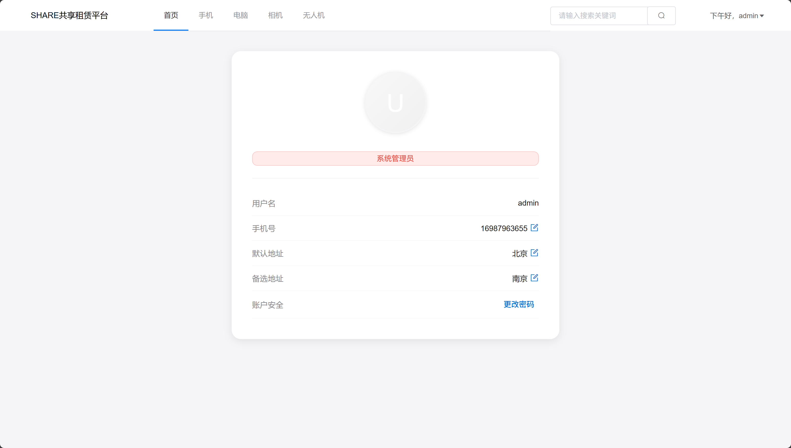
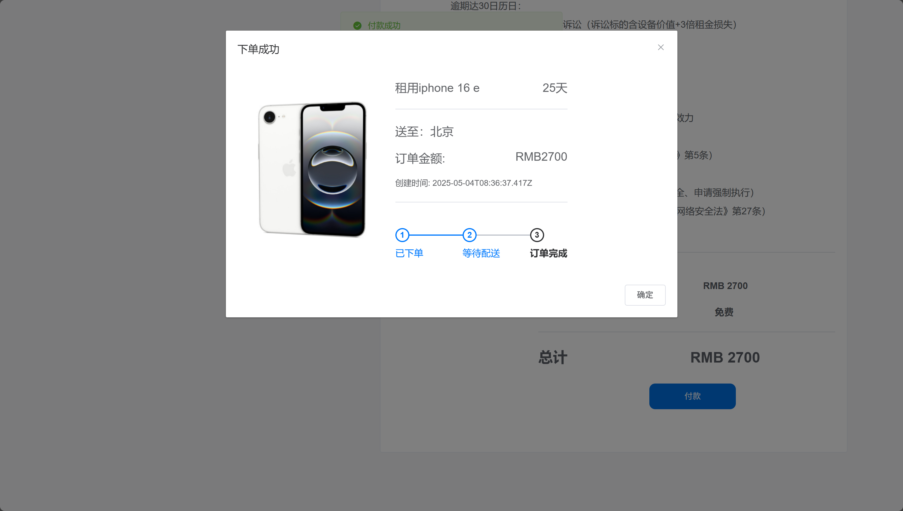
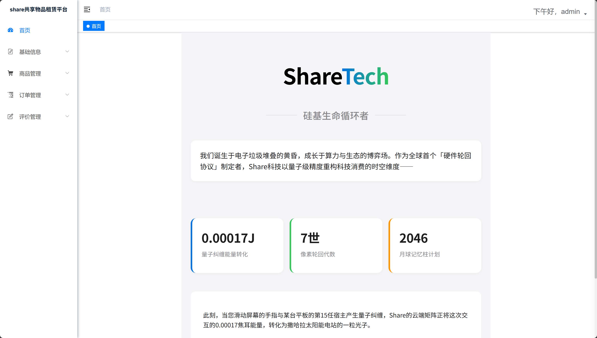
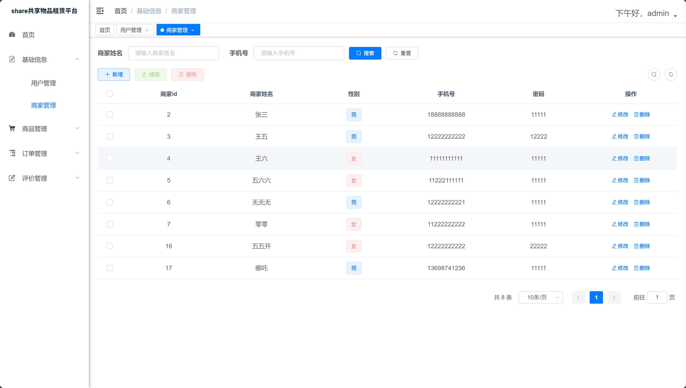
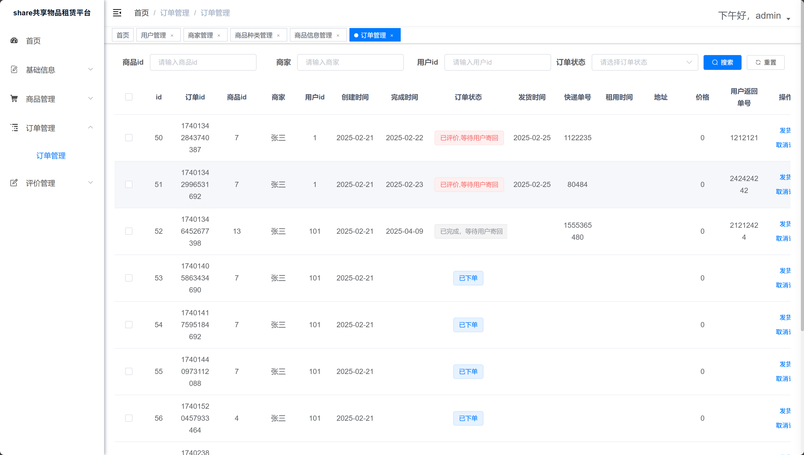

# Share ———共享物品租赁平台
>本repo是基于若依开发的毕业设计，在前端参考了苹果商店的页面设计，在功能上实现了系统商城页面和管理端后台页面以及相关功能，在权限上实现了三种角色的区分。
>
>网页前台页面功能包括：商品浏览，商品分类，商品搜索，订单管理，商品评价，个人中心等功能。 
>网页后台页面功能包括：用户管理，商家管理，商品管理，商品分类管理，评价管理等功能。 
>### 作者qq：3450028172
>### 请作者喝一杯咖啡：
>
## 项目概述
- **角色体系**：普通用户 / 商家 / 管理员
- **特别声明**：本项目为免费开源作品，禁止商业倒卖
- **已知问题**：用户管理表与登录表存在异步问题（技术限制暂未完全解决）
- 项目资源网盘地址（项目源代码+sql数据表）：https://pan.quark.cn/s/8ed4d81a5b19 
- 管理员账号：admin/admin123

## 技术架构
- **后端**：Spring Boot + Spring Security + JWT
- **前端**：Vue.js
- **数据库**：MySQL 8.0
- **中间件**：Redis 5

## 功能模块
### 用户端
- 商品浏览（带鼠标悬停3D效果）
- 分类检索/关键词搜索
- 订单全流程管理
- 带图评价系统
- 个人中心

### 管理端
- 用户/商家分级管理
- 商品分类管理
- 评价审核系统
- 数据统计看板

## 部署指南
**环境要求**：
- JDK 1.7
- Maven 3.8 
- MySQL 8.0
- Redis 5

## 设计亮点
- 动态交互：CSS3实现的商品悬浮效果
- 权限控制：基于角色的路由守卫
- 安全策略：JWT+Spring Security双重验证
- UI设计：Apple风格毛玻璃效果

## 效果图
### 前台首页：

### 登录：

### 注册：

### 前台订单管理：

### 商品详情页：

### 前台个人中心：

### 支付功能：

### 后台首页：

### 商家管理：

### 后台订单管理：

